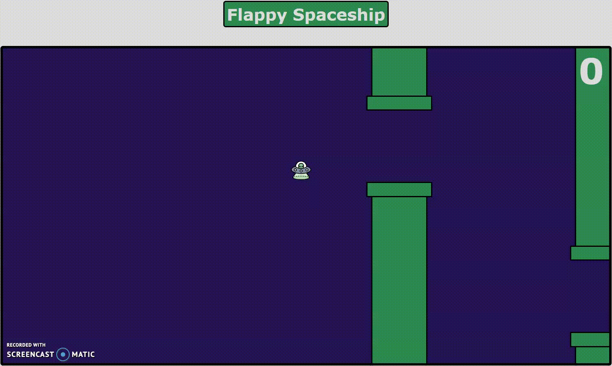

<h1 align="center"> 
    Jogo - Flappy Spaceship
</h1>
<h1>
    
</h1>

## 📖 Sobre:

    O projeto "Flappy Spaceship" é baseado no jogo "Flappy Bird". Se trata de um projeto para treinar as funcionalidades da linguagem Javascript, integrada a CSS e HTML, sem usar nenhum Framework.

---

## 💻 Tecnologias utilizadas:

- Javascript
- HTML
- CSS
- Ambiente de Desenvolvimento: Visual Studio Code

---

<h3 align="center">
    Matheus Franco
</h3>
